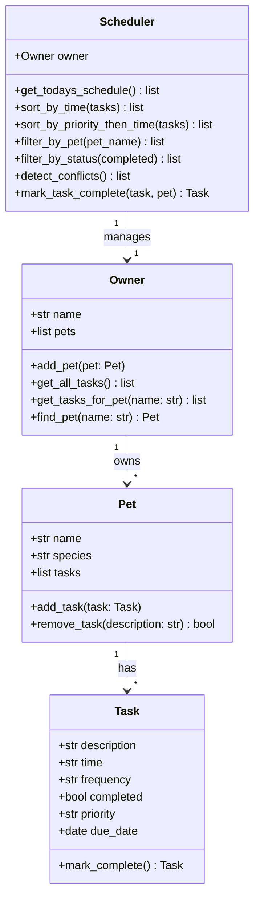

# PawPal+ (Module 2 Project)

**PawPal+** is a smart pet care management system that helps owners keep their furry friends happy and healthy by tracking daily routines — feedings, walks, medications, and appointments — using algorithmic scheduling logic.

## 📸 Demo

Run the app:

```bash
streamlit run app.py
```

## Features

- **Owner & Pet Management** — Create an owner profile and register multiple pets (dog, cat, bird, rabbit, etc.)
- **Task Scheduling** — Add care tasks with a time, frequency, and priority to any pet
- **Sorting by Time** — View today's schedule in chronological order (HH:MM)
- **Priority-First Sorting** — Sort tasks by High → Medium → Low priority, then by time within each tier
- **Conflict Warnings** — Automatically detect and display a warning when two tasks share the same time slot
- **Daily & Weekly Recurrence** — Marking a `daily` or `weekly` task complete automatically schedules the next occurrence
- **Filtering by Pet** — Quickly view only the tasks belonging to a specific pet
- **Status Filtering** — Separate incomplete tasks from completed ones
- **Interactive UI** — Mark tasks complete directly in the Streamlit interface

## Smarter Scheduling

The `Scheduler` class implements four algorithmic capabilities:

| Algorithm | Description |
|---|---|
| Time sort | `sort_by_time()` uses Python's `sorted()` with a lambda key on HH:MM strings |
| Priority sort | `sort_by_priority_then_time()` uses a two-key tuple so High tasks always surface first |
| Conflict detection | `detect_conflicts()` uses a dictionary to find time collisions in O(n) |
| Recurrence | `mark_task_complete()` uses `timedelta` to auto-schedule daily (+1 day) and weekly (+7 days) tasks |

## System Architecture (UML)



## Getting Started

### Setup

```bash
python -m venv .venv
source .venv/bin/activate  # Windows: .venv\Scripts\activate
pip install -r requirements.txt
```

### Run the app

```bash
streamlit run app.py
```

### Run the CLI demo

```bash
python main.py
```

## Testing PawPal+

### Run tests

```bash
python -m pytest tests/ -v
```

### What the tests cover

| Test class | What is verified |
|---|---|
| `TestTaskCompletion` | `mark_complete()` sets `completed=True`; once/daily/weekly recurrence returns correct next date |
| `TestPet` | Adding/removing tasks, task count changes |
| `TestOwner` | Pet registration, `get_all_tasks()` aggregation, `find_pet()` case-insensitivity |
| `TestSchedulerSorting` | Chronological sort, priority-first sort order |
| `TestSchedulerFiltering` | Per-pet filter, status filter |
| `TestConflictDetection` | Flags duplicate times; ignores completed tasks |
| `TestRecurringTaskIntegration` | `mark_task_complete()` adds next occurrence to pet's task list |

**Confidence Level:** ★★★★☆ — All 23 tests pass. Edge cases covered include: empty pet schedules, case-insensitive pet lookup, completed tasks excluded from conflict checks, and once/daily/weekly recurrence variations.
